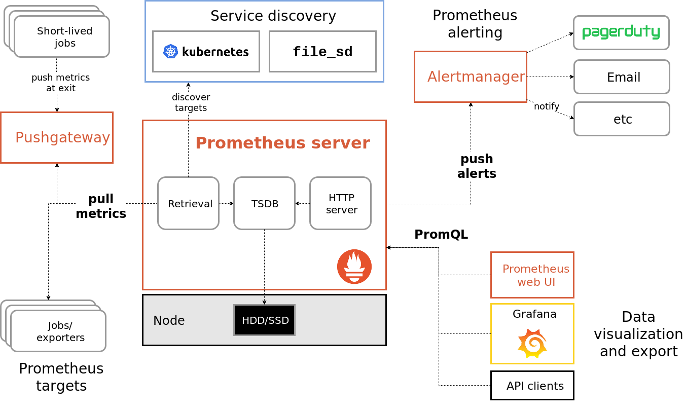

# Prometheus

## Module

Prometheus is an open-source systems monitoring and alerting toolkit originally built at SoundCloud. It is now a standalone open source project and maintained independently of any company.

#### Overview

At the end of this module, you will :

* _Learn how to deploy Prometheus_
* _Learn how to monitor Kubernetes resources_
* _Learn how to manage metrics, rules and alerts_

#### Prerequisites

Create the directory `data/monitoring` in your home folder to manage the YAML file needed in this module.

```bash
mkdir ~/data/monitoring
```

## Prometheus

Prometheus is a full monitoring and trending system that includes built-in and active scraping, storing, querying, graphing, and alerting based on time series data. It has knowledge about what the environment should look like \(which endpoints should exist, what time series patterns mean trouble, etc.\), and actively tries to find faults. 

Prometheus works well for recording any purely numeric time series. It fits both machine-centric monitoring as well as monitoring of highly dynamic service-oriented architectures. 

In a world of microservices, its support for multi-dimensional data collection and querying is a particular strength. Prometheus is designed for reliability, to be the system you go to during an outage to allow you to quickly diagnose problems.

The schema below describe the Prometheus architecture with each component and their roles :



Globally, Prometheus can be broken down into 4 parts : 

* **Prometheus Server** : Main heart of Prometheus which scrapes and stores time series data. PromQL is the query language for Prometheus time series Data.
* **Pushgateway :** For supporting short-lived jobs. The Prometheus Pushgateway exists to allow ephemeral and batch jobs to expose their metrics to Prometheus. Since these kinds of jobs may not exist long enough to be scraped, they can instead push their metrics to a Pushgateway. The Pushgateway then exposes these metrics to Prometheus.
* **Jobs/Exporter** : Prometheus plugins are special-purpose exporters for services like HAProxy, StatsD, Graphite, etc. There are a number of libraries and servers which help in exporting existing metrics from third-party systems as Prometheus metrics.
* **Alertmanager** : Handles alerts sent by client applications such as the Prometheus server. It takes care of deduplicating, grouping, and routing them to the correct receiver integrations such as email, PagerDuty, or Slack. It also takes care of silencing and inhibition of alerts..

## Deploy

Prometheus can be deployed on Kubernetes in many ways. This module will explain first how to deploy the stack with the Kubernetes package manage Helm and secondly with YAML files and Kubernetes command line Kubectl.

### With Helm

Helm is a tool that streamlines installing and managing Kubernetes applications. It is usually compared to with Linux package management tools like apt/yum/homebrew but for Kubernetes**.** In order words, its the packaging manager for Kubernetes. 

An alternative to helm is to create manifests files in json/yaml and use kubectl utility to install the manifest files manually but this can be slow and inefficient. Helm makes it quick and easy. 

Helm comprises of a client and server application. The server side is called tiller and the client side is helm.


This module consider that the Helm client is already installed. If it not the case, refer to the cheatsheet section on the left menu.


#### Configure the tiller

Tiller usually runs inside the Kubernetes cluster. It needs some privileges to manage the state of each Kubernetes objects that it manages.

```bash
# Create a dedicated service account named tiller
kubectl -n kube-system create sa tiller

# Attach the role cluster-admin to the dedicated service account
kubectl create clusterrolebinding tiller --clusterrole cluster-admin --serviceaccount=kube-system:tiller

# Upgrade the tiller configuration with the dedicated service account
helm init --service-account tiller --upgrade
```

#### Deploy the operator

Create a namespace dedicated to the monitoring stack.

Deploy Prometheus operator in it.



```bash
helm install coreos/prometheus-operator --name prometheus-operator --namespace monitoring 
```



```bash
NAME:   prometheus-operator
LAST DEPLOYED: Thu Apr 11 09:58:39 2019
NAMESPACE: monitoring
STATUS: DEPLOYED

RESOURCES:
==> v1/ConfigMap
NAME                 DATA  AGE
prometheus-operator  1     2m22s

==> v1/Pod(related)
NAME                                  READY  STATUS   RESTARTS  AGE
prometheus-operator-545b59ffc9-d4gml  1/1    Running  0         2m22s

==> v1/ServiceAccount
NAME                 SECRETS  AGE
prometheus-operator  1        2m22s

==> v1beta1/ClusterRole
NAME                     AGE
prometheus-operator      2m22s
psp-prometheus-operator  2m22s

==> v1beta1/ClusterRoleBinding
NAME                     AGE
prometheus-operator      2m22s
psp-prometheus-operator  2m22s

==> v1beta1/Deployment
NAME                 READY  UP-TO-DATE  AVAILABLE  AGE
prometheus-operator  1/1    1           1          2m22s

==> v1beta1/PodSecurityPolicy
NAME                 PRIV   CAPS      SELINUX   RUNASUSER  FSGROUP    SUPGROUP  READONLYROOTFS  VOLUMES
prometheus-operator  false  RunAsAny  RunAsAny  MustRunAs  MustRunAs  false     configMap,emptyDir,projected,secret,downwardAPI,persistentVolumeClaim


NOTES:
The Prometheus Operator has been installed. Check its status by running:
  kubectl --namespace monitoring get pods -l "app=prometheus-operator,release=prometheus-operator"

Visit https://github.com/coreos/prometheus-operator for instructions on how
to create & configure Alertmanager and Prometheus instances using the Operator.
```



#### Deploy Prometheus

Deploy the Prometheus stack in the dedicated namespace.



```bash
helm install coreos/kube-prometheus --name kube-prometheus --set global.rbacEnable=true --namespace monitoring
```



```bash
NAME:   kube-prometheus
LAST DEPLOYED: Thu Apr 11 10:02:02 2019
NAMESPACE: monitoring
STATUS: DEPLOYED

RESOURCES:
==> v1/Alertmanager
NAME             AGE
kube-prometheus  1s

==> v1/ConfigMap
NAME                     DATA  AGE
kube-prometheus-grafana  10    2s

==> v1/Pod(related)
NAME                                                  READY  STATUS             RESTARTS  AGE
kube-prometheus-exporter-kube-state-5858d86974-5ps8z  0/2    ContainerCreating  0         1s
kube-prometheus-exporter-node-7c49t                   0/1    ContainerCreating  0         1s
kube-prometheus-grafana-6c4dffd84d-pjb6p              0/2    ContainerCreating  0         1s

==> v1/Prometheus
NAME             AGE
kube-prometheus  1s

==> v1/PrometheusRule
NAME                                              AGE
kube-prometheus                                   1s
kube-prometheus-alertmanager                      1s
kube-prometheus-exporter-kube-controller-manager  1s
kube-prometheus-exporter-kube-etcd                1s
kube-prometheus-exporter-kube-scheduler           1s
kube-prometheus-exporter-kube-state               1s
kube-prometheus-exporter-kubelets                 1s
kube-prometheus-exporter-kubernetes               1s
kube-prometheus-exporter-node                     1s
kube-prometheus-rules                             1s

==> v1/Secret
NAME                          TYPE    DATA  AGE
alertmanager-kube-prometheus  Opaque  1     2s
kube-prometheus-grafana       Opaque  2     2s

==> v1/Service
NAME                                              TYPE       CLUSTER-IP      EXTERNAL-IP  PORT(S)              AGE
kube-prometheus                                   ClusterIP  10.108.177.181  <none>       9090/TCP             2s
kube-prometheus-alertmanager                      ClusterIP  10.98.18.115    <none>       9093/TCP             2s
kube-prometheus-exporter-kube-controller-manager  ClusterIP  None            <none>       10252/TCP            2s
kube-prometheus-exporter-kube-dns                 ClusterIP  None            <none>       10054/TCP,10055/TCP  2s
kube-prometheus-exporter-kube-etcd                ClusterIP  None            <none>       4001/TCP             2s
kube-prometheus-exporter-kube-scheduler           ClusterIP  None            <none>       10251/TCP            2s
kube-prometheus-exporter-kube-state               ClusterIP  10.98.248.122   <none>       80/TCP               2s
kube-prometheus-exporter-node                     ClusterIP  10.103.171.99   <none>       9100/TCP             2s
kube-prometheus-grafana                           ClusterIP  10.98.4.110     <none>       80/TCP               2s

==> v1/ServiceAccount
NAME                                 SECRETS  AGE
kube-prometheus                      1        2s
kube-prometheus-exporter-kube-state  1        2s
kube-prometheus-exporter-node        1        2s
kube-prometheus-grafana              1        2s

==> v1/ServiceMonitor
NAME                                              AGE
kube-prometheus                                   0s
kube-prometheus-alertmanager                      1s
kube-prometheus-exporter-kube-controller-manager  1s
kube-prometheus-exporter-kube-dns                 1s
kube-prometheus-exporter-kube-etcd                1s
kube-prometheus-exporter-kube-scheduler           1s
kube-prometheus-exporter-kube-state               1s
kube-prometheus-exporter-kubelets                 1s
kube-prometheus-exporter-kubernetes               1s
kube-prometheus-exporter-node                     1s
kube-prometheus-grafana                           0s

==> v1beta1/ClusterRole
NAME                                     AGE
kube-prometheus                          2s
kube-prometheus-exporter-kube-state      2s
psp-kube-prometheus                      2s
psp-kube-prometheus-alertmanager         2s
psp-kube-prometheus-exporter-kube-state  2s
psp-kube-prometheus-exporter-node        2s
psp-kube-prometheus-grafana              2s

==> v1beta1/ClusterRoleBinding
NAME                                     AGE
kube-prometheus                          2s
kube-prometheus-exporter-kube-state      2s
psp-kube-prometheus                      2s
psp-kube-prometheus-alertmanager         2s
psp-kube-prometheus-exporter-kube-state  2s
psp-kube-prometheus-exporter-node        2s
psp-kube-prometheus-grafana              2s

==> v1beta1/DaemonSet
NAME                           DESIRED  CURRENT  READY  UP-TO-DATE  AVAILABLE  NODE SELECTOR  AGE
kube-prometheus-exporter-node  1        1        0      1           0          <none>         2s

==> v1beta1/Deployment
NAME                                 READY  UP-TO-DATE  AVAILABLE  AGE
kube-prometheus-exporter-kube-state  0/1    1           0          2s
kube-prometheus-grafana              0/1    1           0          1s

==> v1beta1/PodSecurityPolicy
NAME                                 PRIV   CAPS      SELINUX   RUNASUSER  FSGROUP    SUPGROUP  READONLYROOTFS  VOLUMES
kube-prometheus                      false  RunAsAny  RunAsAny  MustRunAs  MustRunAs  false     configMap,emptyDir,projected,secret,downwardAPI,persistentVolumeClaim
kube-prometheus-alertmanager         false  RunAsAny  RunAsAny  MustRunAs  MustRunAs  false     configMap,emptyDir,projected,secret,downwardAPI,persistentVolumeClaim
kube-prometheus-exporter-kube-state  false  RunAsAny  RunAsAny  MustRunAs  MustRunAs  false     configMap,emptyDir,projected,secret,downwardAPI,persistentVolumeClaim
kube-prometheus-exporter-node        false  RunAsAny  RunAsAny  MustRunAs  MustRunAs  false     configMap,emptyDir,projected,secret,downwardAPI,persistentVolumeClaim,hostPath
kube-prometheus-grafana              false  RunAsAny  RunAsAny  MustRunAs  MustRunAs  false     configMap,emptyDir,projected,secret,downwardAPI,persistentVolumeClaim,hostPath

==> v1beta1/Role
NAME                                 AGE
kube-prometheus-exporter-kube-state  2s

==> v1beta1/RoleBinding
NAME                                 AGE
kube-prometheus-exporter-kube-state  2s


NOTES:
DEPRECATION NOTICE:

- alertmanager.ingress.fqdn is not used anymore, use alertmanager.ingress.hosts []
- prometheus.ingress.fqdn is not used anymore, use prometheus.ingress.hosts []
- grafana.ingress.fqdn is not used anymore, use prometheus.grafana.hosts []

- additionalRulesConfigMapLabels is not used anymore, use additionalRulesLabels
- prometheus.additionalRulesConfigMapLabels is not used anymore, use additionalRulesLabels
- alertmanager.additionalRulesConfigMapLabels is not used anymore, use additionalRulesLabels
- exporter-kube-controller-manager.additionalRulesConfigMapLabels is not used anymore, use additionalRulesLabels
- exporter-kube-etcd.additionalRulesConfigMapLabels is not used anymore, use additionalRulesLabels
- exporter-kube-scheduler.additionalRulesConfigMapLabels is not used anymore, use additionalRulesLabels
- exporter-kubelets.additionalRulesConfigMapLabels is not used anymore, use additionalRulesLabels
- exporter-kubernetes.additionalRulesConfigMapLabels is not used anymore, use additionalRulesLabels
```



#### Get

Ensure that Prometheus stack is up and running.



```bash
kubectl get all -n monitoring
```



```bash
NAME                                                       READY   STATUS    RESTARTS   AGE
pod/alertmanager-kube-prometheus-0                         2/2     Running   2          11m
pod/kube-prometheus-exporter-kube-state-7fdbfbf866-4wx5h   2/2     Running   0          8m36s
pod/kube-prometheus-exporter-node-7c49t                    1/1     Running   0          11m
pod/kube-prometheus-grafana-6c4dffd84d-pjb6p               2/2     Running   0          11m
pod/prometheus-kube-prometheus-0                           3/3     Running   1          11m
pod/prometheus-operator-545b59ffc9-d4gml                   1/1     Running   0          14m

NAME                                          TYPE        CLUSTER-IP       EXTERNAL-IP   PORT(S)             AGE
service/alertmanager-operated                 ClusterIP   None             <none>        9093/TCP,6783/TCP   11m
service/kube-prometheus                       ClusterIP   10.108.177.181   <none>        9090/TCP            11m
service/kube-prometheus-alertmanager          ClusterIP   10.98.18.115     <none>        9093/TCP            11m
service/kube-prometheus-exporter-kube-state   ClusterIP   10.98.248.122    <none>        80/TCP              11m
service/kube-prometheus-exporter-node         ClusterIP   10.103.171.99    <none>        9100/TCP            11m
service/kube-prometheus-grafana               ClusterIP   10.98.4.110      <none>        80/TCP              11m
service/prometheus-operated                   ClusterIP   None             <none>        9090/TCP            11m

NAME                                           DESIRED   CURRENT   READY   UP-TO-DATE   AVAILABLE   NODE SELECTOR   AGE
daemonset.apps/kube-prometheus-exporter-node   1         1         1       1            1           <none>          11m

NAME                                                  READY   UP-TO-DATE   AVAILABLE   AGE
deployment.apps/kube-prometheus-exporter-kube-state   1/1     1            1           11m
deployment.apps/kube-prometheus-grafana               1/1     1            1           11m
deployment.apps/prometheus-operator                   1/1     1            1           14m

NAME                                                             DESIRED   CURRENT   READY   AGE
replicaset.apps/kube-prometheus-exporter-kube-state-5858d86974   0         0         0       11m
replicaset.apps/kube-prometheus-exporter-kube-state-7fdbfbf866   1         1         1       8m36s
replicaset.apps/kube-prometheus-grafana-6c4dffd84d               1         1         1       11m
replicaset.apps/prometheus-operator-545b59ffc9                   1         1         1       14m

NAME                                            READY   AGE
statefulset.apps/alertmanager-kube-prometheus   1/1     11m
statefulset.apps/prometheus-kube-prometheus     1/1     11m
```



### With Kubectl

## Module exercise

## External documentation

Those documentations can help you to go further in this topic :

* Prometheus official documentation to [get started](https://prometheus.io/docs/prometheus/latest/getting_started/)

